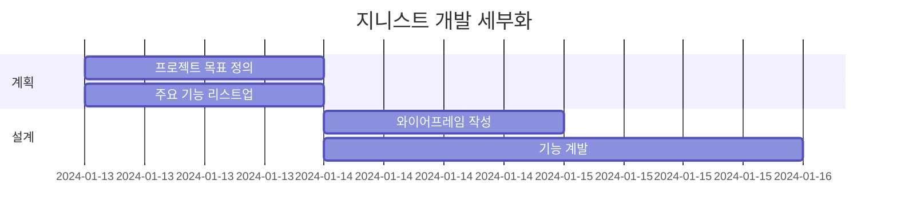

# 개인 비서, 지니스트 (Genist)
Genius와 Assist의 합성어로 스케줄 관리나 개인에게 도움을 줄 수 있는 뛰어난 개인 비서를 의미합니다.

### 💻 소개
HTML / CSS / JS MINI 개인 프로젝트
주제는 ChatGPT를 이용한 자율 주제로 제공된 서버 API를 이용하여 간단한 서비스를 구현하는 것이 목표입니다.

### 🕰 기간
2024-02-13 ~ 2024-02-16

### ⚙ 환경
IDE : Visual Studio Code

### 📌 기능

### WBS

