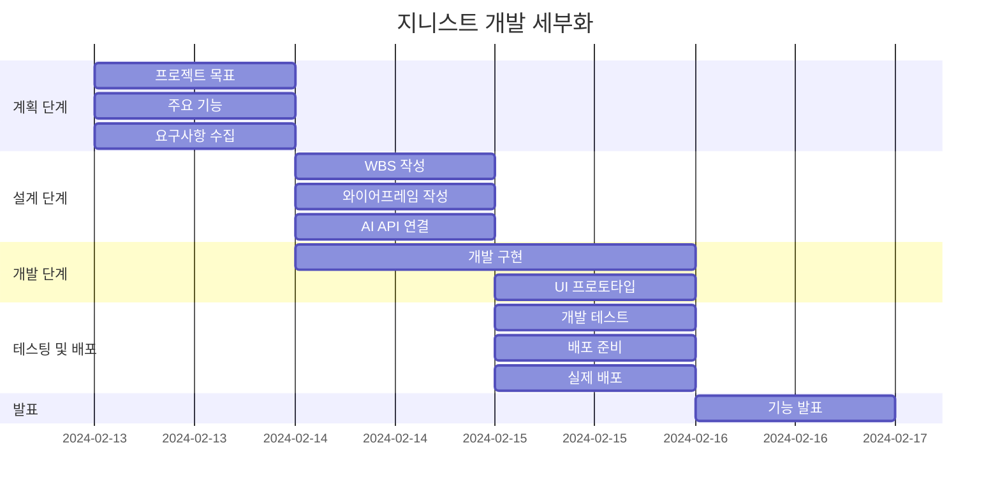

# 개인 비서, 지니스트 (Genist)
>**Genius와 Assist의 합성어로 스케줄 관리나 개인에게 도움을 줄 수 있는 뛰어난 개인 비서를 의미합니다.**

### 💻 소개
>**HTML / CSS / JS MINI 개인 프로젝트**  
>**주제는 ChatGPT를 이용한 자율 주제로 제공된 서버 API를 이용하여 간단한 서비스를 구현하는 것이 목표입니다.**

### 🕰 기간
>**2024-02-13 ~ 2024-02-16**

### ⚙ 환경
>**IDE : Visual Studio Code**  
>**배포 URL : https://soohyun020812.github.io/Portfolio/**

### 📌 기능
>**일정 추가**  
>**일정 조회**  
>**일정 삭제**
+ 일정 수정
+ 지니스트 채팅
+ 지니스트 종료

### 🔎 WBS

### 📏 와이어프레임
https://github.com/soohyun020812/Portfolio/assets/131852352/46f7633c-6965-479d-9468-54c50821059d

### 프로젝트 회고
