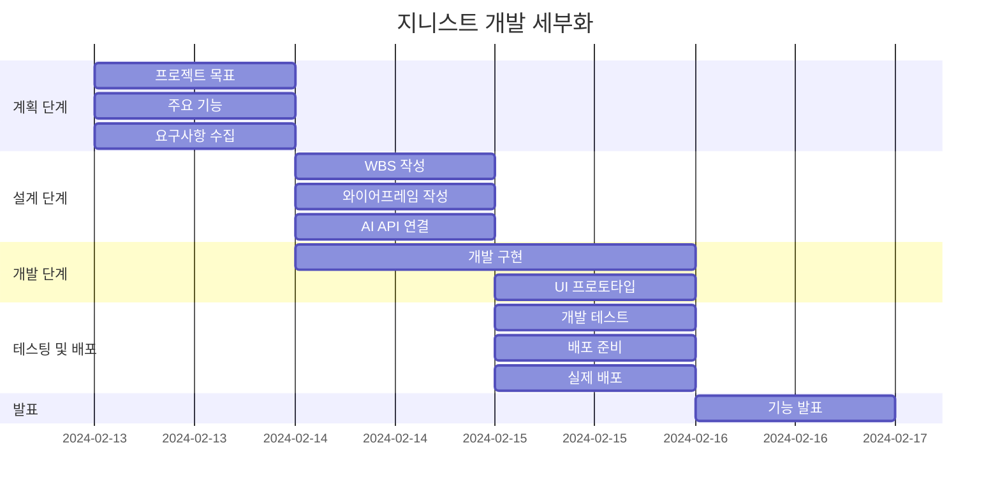

# 개인 비서, 지니스트 (Genist)
>**Genius와 Assist의 합성어로 스케줄 관리나 개인에게 도움을 줄 수 있는 뛰어난 개인 비서를 의미합니다.**

### 💻 소개
>**HTML / CSS / JS MINI 개인 프로젝트**  
>**주제는 ChatGPT를 이용한 자율 주제로 제공된 서버 API를 이용하여 간단한 서비스를 구현하는 것이 목표입니다.**

### 🕰 기간
>**2024-02-13 ~ 2024-02-16**

### ⚙ 환경
>**IDE : Visual Studio Code**  
>**Code : HTML, CSS, JavaScript**  
>**배포 URL : https://soohyun020812.github.io/Portfolio/**

### 📌 기능
>**일정 추가**  
>**일정 조회**  
>**일정 삭제**  
>~~**지니스트 채팅**~~  
>~~**지니스트 종료**~~

### 📂 구조
📦 24.02.13_02.16_프로젝트1
 ┣ 📜index.html
 ┣ 📜Genist.css
 ┣ 📜Genist.js
 ┗ 📜README.md

### 🔎 WBS

### 📏 와이어프레임

### 구현 화면

### 프로젝트 회고
