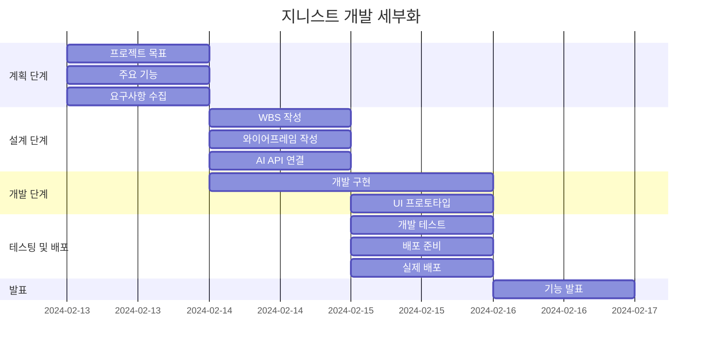

# 개인 비서, 지니스트 (Genist)
>**Genius와 Assist의 합성어로 스케줄 관리나 개인에게 도움을 줄 수 있는 뛰어난 개인 비서를 의미합니다.**

### 💻 소개
>**HTML / CSS / JS Mini Project**  
>**주제는 ChatGPT를 이용한 자율 주제로 개인 프로젝트입니다.**
>**제공된 서버 API를 이용하여 사용자에게 간단한 일정 관리 서비스를 구현하는 것이 목표입니다.**

### 🕰 기간
>**2024-02-13 ~ 2024-02-16**

### ⚙ 환경
>**IDE : Visual Studio Code**  
>**Code : HTML, CSS, JavaScript**  
>**배포 URL : https://soohyun020812.github.io/Portfolio/**

### 📌 기능
>**일정 추가**  
>**일정 조회**  
>**일정 삭제**  
>~~**채팅하기**~~  
>~~**종료하기**~~

### 📂 구조
📦 24.02.13_02.16_프로젝트1  
 ┣ 📜index.html  
 ┣ 📜Genist.css  
 ┣ 📜Genist.js  
 ┗ 📜README.md

### 🔎 WBS
>**일정표는 머메이드로 작성**

### 📏 와이어프레임

### 📱 구현 화면

### 💥 에러와 해결 1

버튼을 구성했을 때 일정추가, 일정조회, 일정삭제 총 3개의 버튼을 생성했다.  
버튼의 정렬이 세로로 왼쪽에 치우쳐 있었는데 이를 일렬의 가로로 배치하는 과정에서 문제가 생겼다.  
해결 방법은 관련 3개의 버튼을 새로운 div로 묶고, container을 flex로 세로정렬하여 3개의 버튼을 묶고 해결되었다.  

### 💥 에러와 해결 2

사용자가 일정추가를 완료하고 일정조회, 일정삭제를 진행할 때 출력값과 API의 출력 2개가 겹치는 문제가 생겼다.  
문제 원인은 조회 버튼에 appendMessage로 일정 조회 결과를 출력한 후, fetch의 결과로 appendChild가 발생하는 것이었다.  
해당 부분을 제외하기 위해 $answer.appendChild(chatMessage); 코드를 주석 처리 해주었다.

### 💭 프로젝트 회고
프로젝트를 진행하며 기획 단계의 중요성을 다시 한 번 깨달을 수 있었다.  
팀원들과의 협업 프로젝트에서는 각자의 경험과 아이디어를 나누며 역할을 분담하는 시간이 있었지만,  
개인 프로젝트는 처음부터 끝까지 스스로 수행해야 하는 부분에서 첫 걸음의 중요성을 명확히 이해되었다.  
기획 단계를 탄탄하게 수립하면 프로젝트 진행 중에 해야 할 일들의 방향성이 명확해지고, 작업이 원활하게 진행될 수 있지만  
기획이 부족하거나 미흡할 경우 프로젝트 진행 중 어려움에 부딪히는 경험을 겪게 되었다.  
이러한 경험을 통해 개발 과정에서 기획 단계의 중요성을 다시금 인지하며,  
앞으로의 프로젝트에서는 기획 단계에 더욱 신경을 쓰고 초기에 충분한 시간을 통해 목표와 방향을 명확히 정립해야겠다.  
다음 프로젝트를 진행하게 될 경우 예상치 못한 문제를 대처할 수 있는 능력을 키울 수 있었던 것 같다.
