# 개인 비서, 지니스트 (Genist)
Genius와 Assist의 합성어로 스케줄 관리나 개인에게 도움을 줄 수 있는 뛰어난 개인 비서를 의미합니다.

### 💻 소개
HTML / CSS / JS MINI 개인 프로젝트
주제는 ChatGPT를 이용한 자율 주제로 제공된 서버 API를 이용하여 간단한 서비스를 구현하는 것이 목표입니다.

### 🕰 기간
2024-02-13 ~ 2024-02-16

### ⚙ 환경
IDE : Visual Studio Code

### 📌 기능

### WBS

```mermaid
gantt
    title 지니스트 개발 세부화
    dateFormat  YYYY-MM-DD
    section 계획
    프로젝트 범위 정의        :done,    des1, 2024-01-15, 2d
    요구사항 수집             :active,  des2, after des1, 5d
    section 설계
    와이어프레임 작성         :         des3, after des2, 7d
    데이터베이스 스키마 설계  :         des4, after des2, 7d
    section 개발
    기능 개발                :         dev2, after des2, 10d
    section 테스트
    테스트 케이스 작성       :         tes1, after dev2, 2d
    테스트                  :         tes2, after dev1, 2d
    section 배포
    배포 준비               :         dep1, after tes2, 2d
    출시                    :         dep2, after dep1, 1d
```

